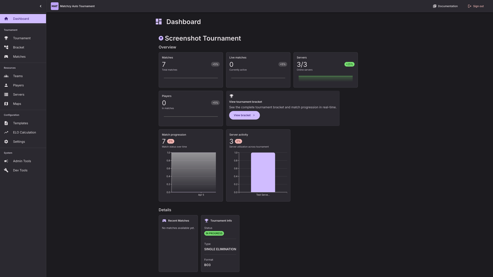

# Screenshots

Take a tour of MatchZy Auto Tournament's interface. Click any image to view in full size.

---

## Dashboard

Get started quickly with the onboarding checklist and quick access cards.

---

## Tournament Setup

### Welcome Screen

When creating a new tournament, you'll first see the welcome screen where you can choose to create a new tournament from scratch or load from a template.

### Tournament Creation Wizard (Step by Step)

#### Step 1 – Name

Set the tournament name in the first step of the wizard.

#### Step 2 – Tournament Type

Choose between single elimination, double elimination, Swiss, or shuffle tournaments.

#### Step 3 – Match Format

Select the match format (Best of 1, Best of 3, Best of 5) for bracketed tournaments.

#### Step 4 – Maps / Map Pool

Pick a map pool or configure custom maps for the tournament.

#### Step 5 – Teams

Select which teams will participate in the tournament and quickly add all teams if needed.

#### Step 6 – Review

Review all tournament settings before creating the tournament and generating the bracket.

### Shuffle Tournament Setup

Shuffle tournaments use Best of 1 format by default and add an extra configuration step for team size, round limits, overtime mode, and ELO template.

### Tournament Form

Configure your tournament with name, teams, maps, and format in a simple step-by-step form. The tournament is shown before starting (go live).

---

## Team Management

Manage all your teams in one place. Create, edit, and view team rosters with player details.

### Select Player Modal

When editing a team, use the player selection modal to add players to your team roster. Search and filter players, then select multiple players at once.

---

## Server Management

Configure and monitor your CS2 servers with real-time status indicators. Servers with IP 0.0.0.0 are test servers that always show as online.

---

## Tournament Bracket

Visual bracket showcasing matchups and progression.

---

## Match Management

### Matches Overview

Overview of all matches with live status updates and match cards.

---

## Public Team Pages

### Team Match Page

Teams can view match details, server connection info, and player rosters. This screenshot shows the team page **after the veto is complete**, with the server allocated and match ready to start.

### Map Veto Interface

Interactive FaceIT-style map veto for teams with all competitive maps. Teams take turns banning and picking maps.

**Initial State** - When it's your turn to ban a map:

**After Actions** - After both teams have made their bans:

**Side Pick** - When teams need to pick their starting side (CT or T):

### Connect to Server

Teams can connect directly to the match server using the connect button or copy the console command.

### Tournament Leaderboard

Public leaderboard page showing tournament progress and player rankings. Available for shuffle tournaments.

---

## Admin Tools

Powerful RCON commands and match controls for tournament administrators.

---

## Maps & Map Pools Management

### Maps Page

Manage all your maps with visual cards, add custom maps, and upload map images.

### Map Pools Tab

Create reusable map pools for your tournaments. View all pools with map counts and previews.

---

## Players Management

### Players List

View and manage all players with ELO ratings and statistics.

### Add Player Modal

Add new players manually by entering their Steam ID or name. The system will automatically fetch player information from Steam.

### Find Player

Public search page to find players by name or Steam ID.

### Player Profile

Public player profile page showing detailed statistics, ELO progression, match history, and performance metrics.

---

## Settings

Configure application settings and preferences.

---

## Templates

Manage tournament templates for quick tournament creation.

---

## ELO Calculation Templates

Configure ELO calculation templates with custom weights and formulas.

---

## Key Features Shown

✅ **Onboarding System** - Step-by-step getting started guide  
✅ **Tournament Creation** - Multi-step form with validation  
✅ **Team Management** - Full roster management with team tags  
✅ **Server Management** - Real-time server status monitoring  
✅ **Visual Brackets** - Clean, modern bracket visualization  
✅ **Match Management** - Live match tracking and status updates  
✅ **Match Details** - Player roster with live connection status (0/10 players)  
✅ **Map Veto** - Interactive pick/ban system with map previews  
✅ **Maps & Map Pools** - Custom map management with reusable pools  
✅ **Public Team Pages** - No-auth pages for team access  
✅ **Admin Controls** - Comprehensive RCON command interface with match control buttons  

---

**Ready to get started?**

[Quick Start Guide](getting-started/quick-start.md){ .md-button .md-button--primary }
[View Features](features/overview.md){ .md-button }

